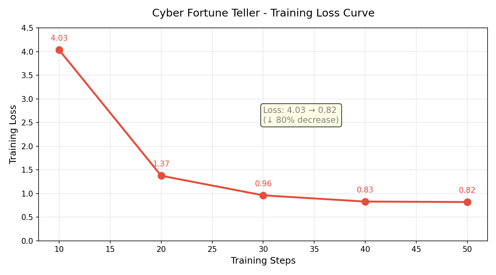

# cyber-fortune-teller
# 🔮 사이버 점쟁이 — Cyber Fortune Teller

> 현대적 언어로 일상 질문에 玄學(현학)적 답변을 제공하는 파인튜닝 LLM

## 프로젝트 소개
본 프로젝트는 연세대학교 자연어정보분석 수업(GAI4008)의 기말 프로젝트입니다.
Unsloth를 활용하여 Qwen3-1.7B 모델을 QLoRA로 파인튜닝하여,
"사이버 점쟁이" 페르소나로 현대인의 일상적인 질문에 답하는 언어 모델을 제작하였습니다.

## 주제
사용자가 일상적인 질문을 입력하면, 모델이 현학적인 스타일(손가락으로 점을 치며, 천기누설, 기운, 명반 등)로 현실적인 조언을 제공합니다.

## 기술 스택
- 베이스 모델: Qwen/Qwen3-1.7B-instruct
- 파인튜닝 방법: QLoRA (4-bit)
- 학습 프레임워크: Unsloth + TRL
- 학습 플랫폼: Google Colab (T4 GPU)
- 로컬 실행: Ollama (Apple M5)

## 데이터셋
- 수량: 300개
- 형식: Alpaca (instruction / input / output)
- 주제: 일상생활, 연애, 직장, 재운, 건강, 인생철학 등

## 하이퍼파라미터 설정

| 파라미터 | 값 | 근거 |
|------|-----|------|
| rank (r) | 16 | 표현력과 파라미터 수의 균형 |
| lora_alpha | 32 | alpha=2×rank, 안정적인 학습 |
| lora_dropout | 0.05 | 과적합 방지 |
| learning_rate | 2e-4 | Unsloth 권장 기본값 |
| epochs | 3 | 300개 데이터 3회 학습, 과적합 방지 |
| batch_size | 4 | T4 16GB VRAM에 적합 |

## 학습 결과

Loss가 4.03에서 0.82로 감소(약 80% 감소), 과적합 현상 없음.



## 베이스 모델 vs 파인튜닝 모델 비교

| 질문 | 베이스 모델 | 파인튜닝 모델 |
|------|---------|---------|
| 오늘 외출해도 될까요? | 날씨에 따라 결정하세요 | 천기를 측정하니, 수성역행에 휴대폰 배터리가 20% 미만... 대흉의 징조입니다 |
| 이직해야 할까요? | 여러 요소를 고려해야 합니다 | 역마성이 움직이니, 한 곳에 오래 머무는 것은 불리합니다... |

## 로컬 실행 방법

```bash
ollama create cyber-fortune -f Modelfile
ollama run cyber-fortune
```

## 파일 구조
- `cyber_fortune_teller.ipynb` — 학습 코드
- `cyber_fortune_dataset_300rows.csv` — 학습 데이터셋
- `loss_curve_fixed.png` — 학습 Loss 곡선
